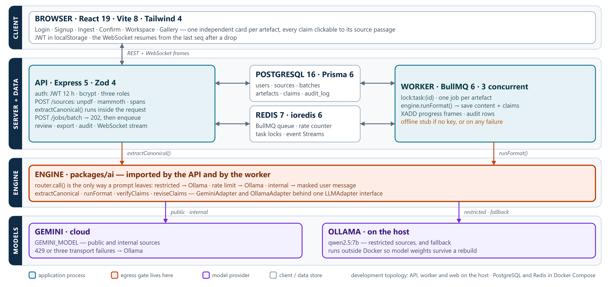
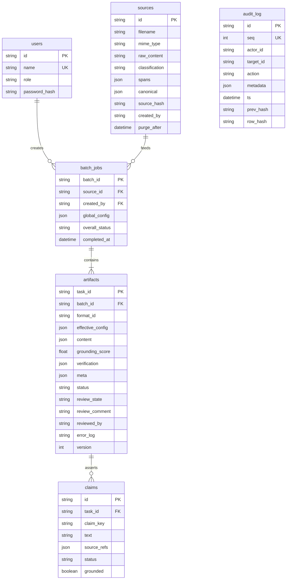
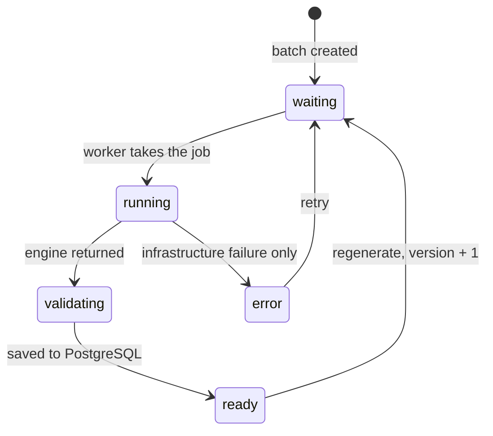
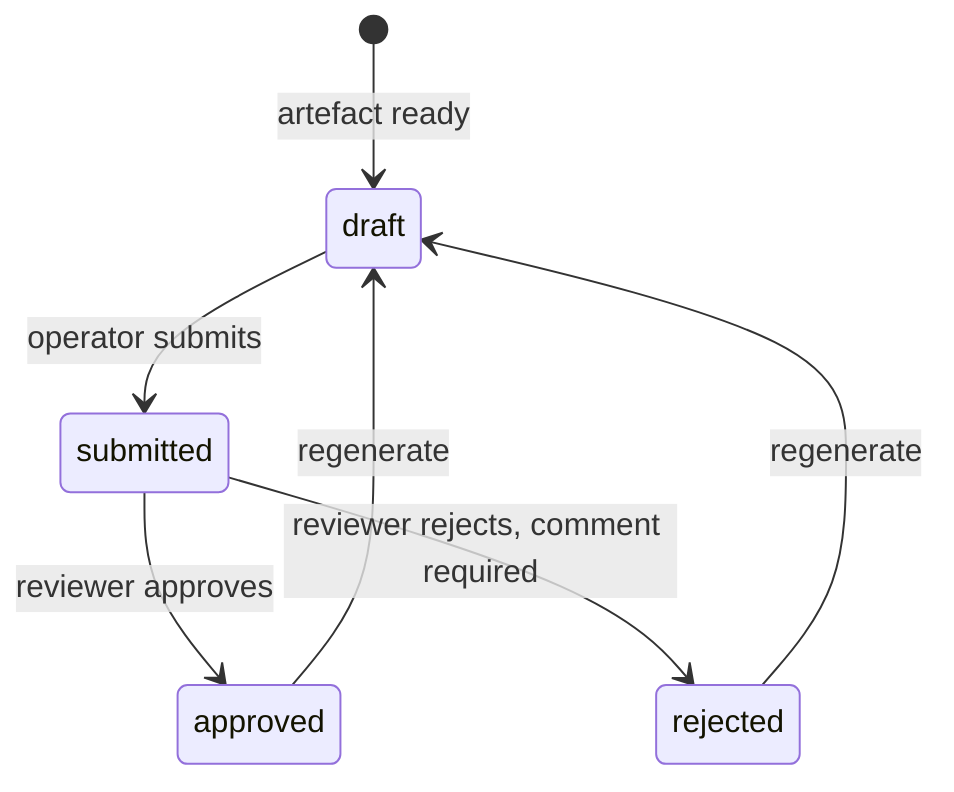
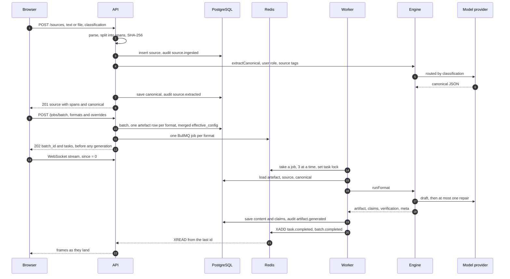
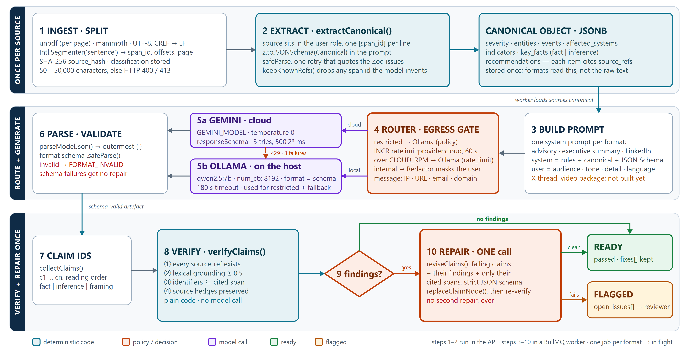

# MetaMorph-AI — System documentation

| | |
| --- | --- |
| **Product** | MetaMorph-AI — Intelligence Content Transformation Engine |
| **Problem statement** | SIH26154 · Gen AI Platform for Automated Content Transformation · NTRO · Blockchain & Cybersecurity |
| **Repository** | <https://github.com/MdFareedKhan01/sih_ps154> |
| **Document date** | 29 September 2026 |
| **Describes** | `main` at `69dac0a`, plus the engine fixes committed with this document |
| **Companion documents** | [`architecture-note.pdf`](architecture-note.pdf) (two pages) · [`tech-stack.md`](tech-stack.md) · [`integration-report-2026-09-28.md`](integration-report-2026-09-28.md) · the SRS in [`final/`](final/) |

## How to read this

This document describes **what the code does**, not what the design intended. The SRS and the
guides in `final/` are the specification; where the implementation differs, this document says
so, with the evidence. Every statement was checked against the source on the date above.

Findings are tagged **KI-nn** and collected in the [known-issues register](#15-known-issues-register).
Requirements are cited as FR-nn, NFR-nn and AC-nn, as in the SRS.

**How it was verified.** Full read of `packages/ai`, `packages/shared`, `apps/server`, `prisma`
and the web app; the automated suite (61 tests, all passing); an end-to-end run against a live
PostgreSQL, Redis, API, worker and web server; and two targeted reproductions of defects
(KI-01, KI-06). **Not verified by the author:** any run against a real language model (no Gemini
key or Ollama was available), PDF and DOCX uploads, and the UI clicked through in a browser.

---

## Contents

1. [Status at a glance](#1-status-at-a-glance)
2. [Purpose, users and scope](#2-purpose-users-and-scope)
3. [Architecture](#3-architecture)
4. [Data model](#4-data-model)
5. [Request lifecycle](#5-request-lifecycle)
6. [The AI engine](#6-the-ai-engine)
7. [Real-time protocol](#7-real-time-protocol)
8. [Security model](#8-security-model)
9. [API reference](#9-api-reference)
10. [Frontend](#10-frontend)
11. [Configuration and operations](#11-configuration-and-operations)
12. [Testing and CI](#12-testing-and-ci)
13. [Performance and benchmarks](#13-performance-and-benchmarks)
14. [Requirements traceability](#14-requirements-traceability)
15. [Known-issues register](#15-known-issues-register)
16. [Glossary and file map](#16-glossary-and-file-map)

---

## 1. Status at a glance

### 1.1 What works

| Capability | State | Evidence |
| --- | --- | --- |
| Ingest pasted text, PDF, DOCX, TXT, MD; split into sentence spans with page numbers | Working | `routes/sources.ts`, `splitSpans`; text path exercised end to end |
| Extract a cited fact index ("canonical object") once per source | Working with a model; stub without | `extract.ts`; needs the key for `AI_PROVIDER` (`GEMINI_API_KEY` or `GROQ_API_KEY`) (KI-03) |
| Generate **advisory**, **executive summary**, **LinkedIn post** from the fact index | Working with a model | `generate.ts`, benchmarks in §13 |
| Batch of up to six formats, per-format configuration overrides | Working | smoke test, AC-11 |
| Three concurrent workers, live progress over WebSocket, resume after a drop | Working | smoke test, AC-13 |
| Every sentence is a claim with source spans; click a claim, its passage highlights | Working | UI component test, AC-2 |
| Four deterministic verification checks, then at most one targeted repair | Working with a model | `verifier.ts`, `revise.ts`, unit tests |
| Classification routing: restricted → on-device model, decided in code before any adapter | Working by design; not exercised against a real model | `router.ts` |
| Roles, JWT sessions, submit / approve / reject, self-approval refused (403) | Working, API only | AC-6, AC-10 verified |
| Markdown and plain-text export | Working | `export.ts` |
| Hash-chained audit log; database refuses edits; `GET /audit/verify` names the first broken row | Working | AC-14 demonstrated |

### 1.2 What is not built, or not as specified

| Gap | Ref |
| --- | --- |
| Only **three of five** formats are implemented in the engine. X thread and video package are listed in the UI but produce the offline stub | KI-11 |
| The "internal" tier masks identifiers during extraction but **not during generation or repair** | KI-01 |
| Only **four of the six** checks the deck lists are implemented (no severity, format-constraint or global-identifier check) | KI-10 |
| **No cached-pack fallback.** The seed script writes keys nothing reads | KI-13 |
| No review, submit or audit **screens**; no reviewer queue endpoint; no inline edit, cancel, PDF, SRT or pack export | KI-19 |
| Config has **four** parameters, not the six the problem statement names | KI-18 |
| Hindi output is accepted by the schema but no prompt asks for it and nothing checks it | KI-17 |
| `DEMO_PERTURB=1` corrupts a CVE, not the 37 → 42 example used in the narrative | KI-14 |

### 1.3 What the deck may and may not claim

| The deck may say | The deck should not say (yet) |
| --- | --- |
| Every sentence carries the source spans it came from; clicking it highlights the passage | "Seven artefact types" — five are selectable, three are built |
| Verification is deterministic code, with no second model | "Six generation parameters" — there are four |
| Five checks: source references exist, lexical grounding ≥ 0.5 (against each cited span or all of them together), identifiers appear in the cited span, source hedges are preserved, and the claim is not truncated (`quality`, added 30 Sep) | "Severity, lengths, counts, emoji, script and durations are checked in code" |
| At most two model calls per artefact, enforced in code and covered by a test | "Internal sources are masked before they leave" without qualification |
| Restricted sources are routed to the on-device model by a check in code, before an adapter is chosen. Every prompt leaves through one function, `router.call()` | "The worker holds the only path out of the host" — the API also calls the engine, for extraction. The single chokepoint is the router, not the worker |
| | "The cloud adapter also refuses restricted requests" — it does not (KI-04) |
| The audit log is hash-chained; an edited row is detected and named; the database refuses ordinary edits | A cached-pack or offline fallback |
| The WebSocket resumes from the last event after a disconnect | "Hindi output" |
| Cloud grounding 1.00 on 3 formats, 1 of 9 drafts needed repair; local 5 of 9 (D's measurements) | "Under 60 seconds" without the word *target* |
| Operators cannot approve their own artefacts | A review interface |

> **Read the grounding score correctly.** `grounding_score` counts claims whose lexical overlap
> with the cited sentence is at least 0.5. A wrong number or a dropped hedge does **not** lower
> it; those appear in `verification`, not in the score (KI-16). A score of 1.00 means every
> claim cites something relevant. It does not mean every claim is correct.

---

## 2. Purpose, users and scope

**Problem.** An organisation writes one piece of source material — a threat report, an
advisory, an incident note — then manually rewrites it for several audiences. For NTRO and
NCIIPC this is the last mile of dissemination: a technical analysis must become a sector
advisory, a leadership brief and a public post, and every rewrite can quietly change a fact.

**System.** An operator submits one source, chooses formats and parameters, and receives each
artefact generated from a single extracted fact index, with every sentence traceable to the
passage it came from, checked in code, and approved by a human before release.

### 2.1 Roles

| Role | May | May not |
| --- | --- | --- |
| **Operator** | Create sources and batches, regenerate, submit, export | Approve. Create batches on another operator's source |
| **Reviewer** | Approve or reject a submitted artefact (rejection needs a comment), export | Create sources or batches |
| **Administrator** | Everything a reviewer may, regenerate, submit, read the audit log and verify the chain | Approve an artefact from a batch they created |

Signup is open and always creates an **operator**. The three demo accounts
(`operator`, `reviewer`, `admin`, password `demo1234`) exist only after `npm run db:seed`.

### 2.2 Scope

In scope: text, PDF and DOCX sources up to 50,000 characters; up to six formats per batch;
classification-tiered routing between a cloud and a local model; human review; append-only audit.

Out of scope: image, video and audio input; OCR; rendered video or images; live publishing to
external platforms; multi-tenant organisations; model fine-tuning; a vector store.

---

## 3. Architecture



*Figure 1 — five tiers. The worker is the only tier that can reach a model provider.*

### 3.1 Processes

| Process | Started by | Does |
| --- | --- | --- |
| **web** | `npm run dev:web` | Vite dev server on `:5173`; proxies `/api` and its WebSocket to the API |
| **api** | `npm run dev:api` | Express on `:8080`: authentication, ingestion, batch creation, review, export, audit, the WebSocket stream. Also runs **canonical extraction inside the ingest request** |
| **worker** | `npm run dev:worker` | BullMQ worker: one job per artefact, three at a time; runs generation, verification and repair; writes results and emits progress |
| **PostgreSQL** | `docker compose up -d` | System of record |
| **Redis** | `docker compose up -d` | Queue, provider rate counter, task locks, event streams |
| **Ollama** | separate install | Local model. Reached over HTTP at `OLLAMA_URL` |

The API and the worker are separate Node processes that share the database, Redis and the
engine package. Both import `@ps154/ai`, so both can reach a provider — the API for extraction,
the worker for generation.

### 3.2 Monorepo

| Package | Path | Owns |
| --- | --- | --- |
| `@ps154/shared` | `packages/shared` | Zod schemas: config, claim, canonical object, formats, verification, API shapes, WebSocket frames, `splitSpans`. Imported by client, server and engine |
| `@ps154/ai` | `packages/ai` | Router, adapters, redaction, extraction, prompts, generation, provenance, verifier, repair |
| `@ps154/server` | `apps/server` | API, worker, audit chain, exports, the `engine.ts` bridge |
| `@ps154/web` | `apps/web` | React client |
| — | `prisma/` | Schema, seed, append-only trigger |
| — | `samples/` | Synthetic input: `demo-incident.md`, `injection-test.md` |

**One schema, both sides of the wire.** Shapes are defined once in Zod and imported by the
browser, the API and the engine. Field names are snake_case everywhere — wire, database and
types — so no mapping layer exists.

### 3.3 The server–engine bridge

`apps/server/src/engine.ts` is the only file that touches `@ps154/ai`. It:

1. calls the real engine **only if the key for `AI_PROVIDER` is set** — `GEMINI_API_KEY` when `gemini`, else `GROQ_API_KEY` (KI-03);
2. adapts the engine's result (`artifact`, `grounding{grounded_count,total_claims}`) into the
   API's shape (`content`, `grounding_score`);
3. emits the `running` and `validating` progress phases (KI-26);
4. on **any** failure other than `EgressBlocked`, falls back to a deterministic **offline stub**
   (KI-12).

The stub copies text from the source and invents nothing. It reports `grounding_score 0`,
`verification.passed false` with one open issue naming itself, and the model
`offline-stub (no model ran)`. It prints a banner on startup. It exists so the pipeline can be
exercised without a model; it is never a substitute for one.

---

## 4. Data model



`audit_log` has no foreign keys by design: it must survive the deletion of what it describes.
`sources.created_by` is a plain string, not a foreign key.

| Table | Notes |
| --- | --- |
| `sources` | Holds the full raw text, the spans (immutable once written) and the canonical object. `source_hash` is SHA-256 of the raw text after CRLF → LF. `purge_after` is set to +30 days but **no job purges** (KI-20) |
| `artifacts` | One row per format per batch. `version` increments on regeneration. `status` (generation) and `review_state` (approval) are separate so a regeneration cannot silently keep an approval — it resets to `draft` |
| `claims` | A denormalised copy of the claims inside `artifacts.content`, keyed `claim_key` = `c1…cn`. Deleted and recreated on every generation |
| `audit_log` | Append-only. `row_hash` = SHA-256 over the row and its predecessor's hash (§8.3) |

### 4.1 State



`revising` exists in the status enum but is **never emitted** (KI-26), and `error` is reachable
only through infrastructure failures such as a database error, because the engine bridge turns
model failures into a flagged stub (KI-12).



`submit` checks only that the artefact is `ready`, not its current `review_state`, so an
approved artefact can be re-submitted, which resets the approval (KI-05).

---

## 5. Request lifecycle



| Step | Detail |
| --- | --- |
| Ingest | Minimum 50 characters after trimming, maximum 50,000, upload ≤ 10 MB. Unsupported types → 415. PDF text is read per page with `unpdf` and pages are joined by a blank line so each span records its page. Extraction failure returns **502 with `source_id`**; the source row remains |
| Extraction is synchronous | It runs inside the HTTP request. Measured 4–31 s on the cloud model and **127–195 s on the local model** (KI-21). The UI says "up to 40 seconds" |
| Batch | 1–6 formats, no duplicates, `effective_config = {...global_config, ...overrides}` per format. The source must belong to the caller (404 otherwise) and must have a canonical object (409 otherwise). Answers `202` in milliseconds |
| Worker | `lock:task:{id}` (300 s, `NX`) prevents double processing. On success it saves the artefact and its claims, emits `task.completed`, writes an audit row. On exception it stores the stack in `error_log`, emits `task.failed` and audits. Whatever happens it releases the lock and recomputes the batch status |
| Batch status | `complete` (none failed), `failed` (none ready), otherwise `partial`. Emitted once, when every artefact is `ready` or `error` |

---

## 6. The AI engine



*Figure 2 — the engine as it runs. Steps 1–2 run once per source; steps 3–10 run once per artefact.*

The public surface is two functions (`packages/ai/src/index.ts`):

```ts
createEngine({ redis }) → {
  extractCanonical(source: SourceForAI),
  runFormat(input: { canonical, spans, format, config, classification })
}
```

### 6.1 Router and egress gate — `router.ts`

The router is the only way a prompt leaves the package.

| Order | Condition | Action | `fallback_reason` |
| --- | --- | --- | --- |
| 1 | `classification === 'restricted'` | Ollama only | `policy` |
| 2 | Cloud counter over budget: `INCR ratelimit:provider:cloud`, `EXPIRE 60`, allowed while ≤ `CLOUD_RPM` (default 10) | Ollama | `rate_limit` |
| 3 | `classification === 'internal'` | `Redactor` masks the **user** message (KI-01) | — |
| 4 | Cloud call, up to three tries, sleeping 500 · 2ⁿ ms between failures | Gemini | — |
| 5 | HTTP 429 | Stop retrying, go to Ollama | `rate_limit` |
| 6 | Three transport failures | Ollama, sent the **unmasked** request | `network` |
| 7 | Any non-transport error | Thrown to the caller | — |

Local fallback receives the original request because it never leaves the host. If Ollama is
also unreachable the error propagates; there is no cache (KI-13).

The check that keeps restricted content off the cloud path is the first `if` in `call()`. The
adapter itself does **not** re-check: `EgressBlocked` is declared in `adapters.ts` and caught
in three other places, but nothing throws it (KI-04).

### 6.2 Adapters — `adapters.ts`

| | `GeminiAdapter` (or `GroqAdapter`, selected by `AI_PROVIDER`) | `OllamaAdapter` |
| --- | --- | --- |
| Endpoint | `@google/genai` `generateContent` | `POST {OLLAMA_URL}/api/chat` |
| Model | `GEMINI_MODEL`, default `gemini-2.5-flash-lite` (Groq: `CLOUD_MODEL`) | `LOCAL_MODEL`, default `qwen2.5:7b` |
| Temperature | 0 | 0 |
| Structured output | `responseMimeType: application/json` and `responseSchema` (Groq: strict `json_schema`) | `format:` the JSON Schema, else `'json'` |
| Limits | provider default (Groq: `max_completion_tokens 8192`) | `num_ctx 8192`, timeout `LOCAL_TIMEOUT_MS` (180 s) |
| Errors | 429 → `RateLimitError`; anything else → `TransportError` | non-OK, empty, timeout → `TransportError` |

A wrong or expired Gemini key, or a model id the key cannot use, surfaces as `TransportError`, so it is retried three times and then
falls back to Ollama with `fallback_reason: network`.

### 6.3 Extraction — `extract.ts`

1. The system prompt is `EXTRACTION_SYSTEM` with `z.toJSONSchema(Canonical)` substituted in.
2. The **user** message is `<source>` tags around one `[span_id] sentence` per line. This is
   the correct pattern: source text is delimited data in the user role.
3. Up to two attempts. The second quotes the first's Zod issues back to the model.
4. `Canonical.safeParse`, then `keepKnownRefs()` drops any `span_id` the model invented and any
   item left with no source.
5. Failure twice → `EXTRACTION_INVALID`.

The extraction prompt forces `key_facts.status = inference` whenever the sentence contains any
of a list of hedge triggers (`may`, `possibly`, `potentially`, `suspected`, `consistent with`,
`moderate confidence`, …) and tells the model to keep the source's hedge wording.

**The canonical object** (`packages/shared/src/canonical.ts`) has seven groups, each item
citing `source_refs`: `severity`, `entities`, `events`, `affected_systems`, `indicators`,
`key_facts` (`fact` | `inference`), `recommendations`.

### 6.4 Generation — `generate.ts`

For each artefact:

1. **Prompt.** The per-format system prompt has `{{canonical}}` and `{{schema}}` substituted:
   the **canonical object and the JSON Schema go in the system message.** The **user** message
   is only `{audience, tone, detail, language}` as JSON.
2. **Route and call** through the router (§6.1).
3. **Parse.** `parseModelJson()` takes the outermost `{ … }`; the format schema's `safeParse`
   validates it. **Invalid → `FORMAT_INVALID`, thrown immediately. There is no repair for a
   schema failure.**
4. **Claim ids.** `collectClaims()` walks the content, gives every claim node an id
   (`c1…cn`, reading order) and returns the nodes.
5. **Verify** (§6.6). If it passes, skip to step 8.
6. **Repair, once** (§6.7).
7. **Re-verify.** Whatever remains is returned as `open_issues`; there is no second repair.
8. **Mark grounding.** A claim is `grounded: false` only if it has a `grounding` finding.
9. Return `{ artifact, claims, grounding{scores, grounded_count, total_claims}, verification, meta }`.

| Format | Fields (claims marked ◆) |
| --- | --- |
| **Advisory** | `title`, `severity`, `summary` ◆ (1–4), `affected_systems` ◆, `indicators` (`type`, `value`, `source_refs`; **not claims**), `mitigations` ◆ (≥ 1), `references` |
| **Executive summary** | `headline`, `key_points` ◆ (3–5), `impact` ◆ (1–3), `decisions_required` ◆ (1–3) |
| **LinkedIn post** | `hook` ◆, `body` ◆ (2–10), `hashtags` (≤ 5) |
| X thread, video package | Schemas exist in `@ps154/shared`. **No prompt, no engine path** — the server returns the offline stub (KI-11) |

**Configuration reaches the model only as JSON in the user message.** Only the executive-summary
prompt tells the model to "respect the requested audience, tone, detail and language". The
advisory and LinkedIn prompts never mention them, and no prompt handles Hindi (KI-17).

### 6.5 Provenance — `provenance.ts`

| Function | Behaviour |
| --- | --- |
| `collectClaims(content)` | Deep-copies content, assigns ids, returns nodes that are the objects inside the copy |
| `terms(text)` | Words of four or more letters (Unicode-aware), stop words removed |
| `postHocRefs(text, spans)` | The span sharing the largest fraction of the claim's terms, if ≥ 0.5; else none |
| `groundingScore(claims)` | Grounded ÷ total, excluding framing claims. **Defined and tested, but not used by `generate.ts`** (KI-16) |

A claim's `status` is `fact` (stated in the source), `inference` (follows from it or is hedged
by it) or `framing` (connective language asserting nothing).

### 6.6 Verifier — `verifier.ts`

Plain TypeScript, no model. `verifyClaims(claims, spans)` runs five checks; `passed` is true only
if there are no findings.

| # | `check` | Rule | Catches |
| --- | --- | --- | --- |
| ① | `constraint` | Every `source_ref` is a real span id | Invented citations |
| ② | `grounding` | Best lexical overlap between the claim and any cited span ≥ 0.5. Framing claims skipped | A sentence attached to an unrelated source |
| ③ | `identifier` | Every number, CVE, IPv4, domain (including `[.]`) and hash in the claim appears in the cited spans | `42` cited to a sentence that says `37` |
| ④ | `hedge` | If a cited span contains a hedge, the claim must too. Framing skipped | "was attacked" from "consistent with a possible…" |

Hedge lexicon: English (*possibly, potentially, suspected, likely, reportedly, apparently,
consistent with, moderate confidence, low confidence, not confirmed, approximately, estimated,
roughly…*), lower-case *may / might / could* only (so "18 May" is not a hedge), and Devanagari
equivalents.

**Not implemented, although the deck lists them (KI-10):** severity equal to the canonical value,
format constraints (character and word limits, emoji, duration sums, script), and the global
identifier scan over titles, headlines and hashtags. Advisory `indicators` are plain objects, so
a fabricated indicator is not checked anywhere. Zod enforces array **counts** only.

### 6.7 Repair — `revise.ts`

Exactly one model call for **all** failing claims together.

- **Input:** each failing claim with its own findings, and **only the spans those claims cited**.
  A claim that cited the wrong span cannot be corrected against the right one.
- **System prompt** forbids new facts and new identifiers, and requires preserving uncertainty.
- **Output:** a strict JSON schema of `{ revisions: [{ id, text, source_refs, status }] }`; every
  target id must come back, and no unknown id may.
- `replaceClaimNode()` writes each revision into the artefact by id, ids are reassigned, and the
  five checks run again.
- A malformed revision **throws**, which the engine bridge turns into the stub (KI-12).

### 6.8 Fault injection — `DEMO_PERTURB`

With `process.env.DEMO_PERTURB === '1'`, after the first verification `generate.ts` finds the
first claim containing `CVE-2026-31337`, rewrites it to `CVE-2026-31338` **in the claims array
only** — not in the artefact content the operator sees — and re-verifies. The identifier check
fails and the repair runs. So the demo exercises the identifier check and the repair, but
(KI-14): it fires only if some claim contains that exact CVE, which depends on what the model
chose to write (the advisory usually will; a short post may not), it does not perturb
`37 → 42`, and `meta.perturbed` is always `false`.

### 6.9 What `meta` really records (KI-15)

| Field | Actual behaviour |
| --- | --- |
| `provider`, `model`, `fallback_reason`, `latency_ms` | From the **first** model call only. A repair call that lands elsewhere is not reflected |
| `attempts` | The bridge defaults it to `1`; it stays `1` even when a repair occurred |
| `perturbed` | Always `false` |

`verification.revised` and `verification.fixes` are the reliable signal that a repair happened.

---

## 7. Real-time protocol

`WS /api/v1/jobs/{batch_id}/stream?since={id}&token={jwt}`

The worker writes frames to the Redis Stream `stream:{batch_id}` (`XADD … MAXLEN ~1000`, expiry
6 h). The API reads with a blocking `XREAD` on a **dedicated Redis connection per socket** and
forwards each entry, adding `seq` = the stream entry id. A client that reconnects passes its last
`seq` as `since` and loses nothing. Pub/Sub would drop events for a disconnected client.

| Event | Fields |
| --- | --- |
| `task.progress` | `task_id`, `status` (`waiting`, `running`, `validating`, `revising`, `ready`, `error`), optional `detail` |
| `task.completed` | `task_id`, `artifact` (the full envelope) |
| `task.failed` | `task_id`, `error_code`, `message`, `retryable` |
| `batch.completed` | `batch_id`, `overall_status` (`complete` \| `partial` \| `failed`), `completed`, `failed` |

Authentication: the JWT travels in the query string because browsers cannot set headers on a
WebSocket. The client reconnects with backoff `min(500 · 2^n, 8000)` ms and replays from its
last `seq`. `GET /jobs/{id}` returns `stream_last_id`, read **before** the rows, so a frame
landing in between is replayed rather than lost.

Two defects to know: `since` is not validated (KI-06 — a malformed value spins Redis at about
1,770 commands per second per socket), and there is no ownership check (KI-05).

---

## 8. Security model

### 8.1 Controls

| Control | Mechanism | State |
| --- | --- | --- |
| Authentication | JWT (HS256 default), 12 h, secret ≥ 16 chars from `JWT_SECRET`; bcrypt cost 10 | Working |
| Authorisation | `requireRole` per route; signup cannot create a non-operator | Working, but see KI-05 |
| Egress | First branch of `router.call()`: `restricted` → Ollama | Working; single layer (KI-04) |
| Masking (internal) | `Redactor`: URL, email, IPv4, domain → `<<KIND_n>>`, restored on return | **Extraction only** (KI-01); `REDACT_TERMS` is broken (KI-02) |
| Input delimiting | Extraction: source in `<source>` tags, user role | Working |
| Injection containment (generation) | "Canonical is data" instruction; output constrained by schema; unsupported text has no valid citation | Partial: canonical sits in the system message (KI-09) |
| Output validation | Zod schema on every model reply; `keepKnownRefs` on extraction | Working |
| Audit | Hash-chained rows, advisory lock, database trigger | Working |
| Transport | CORS limited to `WEB_ORIGIN` | No TLS, rate limiting or security headers in the repository |

### 8.2 Threats

| Threat | Response | Residual risk |
| --- | --- | --- |
| Model states something the source does not support | Five checks, one repair, human approval | Identifiers in plain-string fields and severity are not checked (KI-10) |
| Hostile document instructs the model | Data-in-delimiters (extraction); schema; citation check | Generation prompt weakness (KI-09); no automated injection test |
| Restricted content leaves the host | Routing check before adapter selection | One layer only; an Ollama-less, key-less deployment never reaches the real engine (KI-03) |
| Internal content leaks identifiers | Masking | Generation and repair send them unmasked (KI-01) |
| Audit record altered | Trigger refuses edits; chain detects a bypass | `TRUNCATE` and deleting the newest rows are not detectable from inside the database |
| Another user reads a source or batch | UUID identifiers | No ownership check on read (KI-05) |
| Credential guessing | bcrypt | No lockout or rate limit; demo accounts have a published password (KI-07) |
| Denial of service | — | Malformed `since` (KI-06); zip-expanding DOCX and hostile PDFs are parsed in the API process |

### 8.3 The audit chain

```
row_hash = SHA-256( stable_json([ prev_hash, seq, actor_id, target_id, action, metadata, ts ]) )
```

`stable_json` sorts object keys so identical data always hashes identically. The first row's
`prev_hash` is 64 zeros. Inserts run inside a transaction holding
`pg_advisory_xact_lock(154)`, so the chain is linear and `seq` has no gaps.

`GET /audit/verify` walks every row: it fails if `seq` is not `i + 1`, if `prev_hash` does not
equal the previous `row_hash`, or if the recomputed hash differs. It returns
`{ valid, rows_checked, first_broken_seq }`.

**Recorded actions:** `source.ingested`, `source.extracted`, `batch.created`,
`artifact.generated`, `artifact.failed`, `artifact.regenerate`, `artifact.submitted`,
`artifact.approved`, `artifact.rejected`, `artifact.exported`.
**Not recorded:** sign-in, sign-up, reads.

**Demonstrated on 28 September:** an ordinary `UPDATE` failed with `audit_log is append-only`;
with the trigger disabled by a superuser and row 3 edited, `verify` returned
`{ valid: false, rows_checked: 2, first_broken_seq: 3 }`; after restoring the row it returned
valid again.

**The limit, stated before anyone asks.** This is tamper-*evidence*, not tamper-proofing. An
attacker with write access can delete the newest rows, or `TRUNCATE` the table, without breaking
any surviving hash. The remedy is to publish the head hash somewhere the operator cannot
control — a signed daily digest, a C2PA manifest, or a permissioned ledger.

---

## 9. API reference

Base path `/api/v1`. Every route except `/auth/*` needs `Authorization: Bearer <token>`. Errors
are `{ "error": "…" }`, plus `issues` on a 400.

| Method | Path | Role | Body → response |
| --- | --- | --- | --- |
| `GET` | `/health` (no prefix) | public | `{ ok: true }` |
| `POST` | `/auth/signup` | public | `{ name (3–80), password (8–128) }` → `201 { token, user }`; `409` if the name exists |
| `POST` | `/auth/login` | public | `{ name, password }` → `{ token, user }`; `401` |
| `GET` | `/formats` | signed in | Static list of five formats (KI-11) |
| `POST` | `/sources` | operator | JSON `{ text, classification }` or multipart `file` + `classification` → `201` source; `400` too short; `413` too long; `415` type; `502 { error, source_id }` extraction failed |
| `GET` | `/sources/{id}` | signed in | The source with spans and canonical. **No ownership check** |
| `POST` | `/jobs/batch` | operator | `{ source_id, global_config, formats[1..6] }` → `202 { batch_id, stream_last_id, tasks[] }`; `404` not yours; `409` no canonical |
| `GET` | `/jobs/{batch_id}` | signed in | Snapshot with `stream_last_id`. **No ownership check** |
| `WS` | `/jobs/{batch_id}/stream` | signed in | Frames (§7) |
| `POST` | `/tasks/{id}/regenerate` | operator, admin | → `202 { task_id, version }`. No ownership or state check |
| `POST` | `/tasks/{id}/submit` | operator, admin | → `{ review_state: 'submitted' }`; `409` unless `status = ready` |
| `POST` | `/tasks/{id}/review` | reviewer, admin | `{ decision: 'approve' \| 'reject', comment? }` → `{ review_state }`; `409` not submitted; `403` own batch; `400` rejection without comment |
| `GET` | `/tasks/{id}/export?as=md\|txt` | signed in | The file. `404` if nothing generated |
| `GET` | `/audit?target=` | admin | Latest 200 rows |
| `GET` | `/audit/verify` | admin | `{ valid, rows_checked, first_broken_seq }` |

**Not implemented:** inline edit (`PATCH /tasks/{id}`), cancel a batch, whole-pack export, PDF /
SRT / PPTX export, a reviewer work queue, source deletion.

**The artefact envelope** (`Artifact` in `packages/shared/src/api.ts`): `task_id`, `batch_id`,
`format_id`, `effective_config`, `content`, `claims[]`, `grounding_score`, `verification`
(`passed`, `revised`, `fixes[]`, `open_issues[]`), `meta` (`provider`, `model`,
`fallback_reason`, `attempts`, `latency_ms`, `perturbed`), `status`, `review_state`,
`review_comment`, `error_log` (first line only), `version`.

---

## 10. Frontend

| Route | Screen | Purpose |
| --- | --- | --- |
| `/login`, `/signup` | Sign in / create account | Signup produces an operator |
| `/` | Ingest | Paste or upload; choose public / internal / restricted, each with its consequence stated; 50,000-character counter |
| `/sources/:id` | Confirm and configure | Source pane, extracted-facts panel (severity, actor, systems, indicators, key facts with *inferred* tags), global parameters, format multi-select with per-format overrides |
| `/batches/:id` | Workspace | Source pane on the left, one independent card per format on the right |
| `/gallery` | Gallery | Offline demo of every card state and the provenance interaction; needs no backend |

**State model.** One status per card, never one for the page. Cards live in a record keyed by
`task_id`; a reducer patches exactly one card per frame. A crash inside one card renders a
fallback and leaves its siblings intact (`CardBoundary`).

**Provenance interaction.** Selecting a claim highlights the cited passages in the source pane,
scrolls to the first, and shows a `p.N` chip for PDF sources. Claims are compared **by object**,
not by id, because every card numbers its claims from `c1`. Styling by status: plain (fact),
dotted underline plus *inferred* (inference), wavy amber plus *unverified* (ungrounded), plain
and not clickable (framing).

**Card footer.** Verification badge (`score · N fixes · N flags`, expanding to the findings),
a green *processed on this machine* pill when `meta.provider === 'local'` — **which the offline
stub also triggers** (KI-12) — Regenerate, and Export .md.

**Not present:** Submit, Review and Audit screens (KI-19). `Alt+P` toggles projector mode for
screenshots. The UI still imports several types from `shared-temp.ts` rather than
`@ps154/shared` (KI-22).

---

## 11. Configuration and operations

### 11.1 Environment (`.env`, from `.env.example`)

| Variable | Default | Used by | Meaning |
| --- | --- | --- | --- |
| `PG_PORT`, `REDIS_PORT` | 5432, 6379 | Compose | Host ports. Change these and the URLs if a local PostgreSQL or Redis holds the default |
| `DATABASE_URL`, `REDIS_URL` | localhost | server, engine | Connections |
| `JWT_SECRET` | *example string* | server | **Must be replaced.** The example passes the length check, so a copied file runs with a public secret |
| `PORT`, `WEB_ORIGIN` | 8080, `http://localhost:5173` | server | Listen port; the one allowed CORS origin |
| `AI_PROVIDER` | `groq` | engine | `gemini` or `groq`. Picks the cloud adapter and which key the server checks |
| `GEMINI_API_KEY` | placeholder | server, engine | **Without the key for the chosen provider the real engine is never used** (KI-03) |
| `GEMINI_MODEL` | `gemini-2.5-flash-lite` | engine | Pin the exact version before a demo |
| `GROQ_API_KEY`, `CLOUD_MODEL` | placeholder, `llama-3.3-70b-versatile` | engine | Used when `AI_PROVIDER=groq` |
| `CLOUD_RPM` | 10 | engine | Cloud calls per 60 s before falling back to Ollama |
| `OLLAMA_URL`, `LOCAL_MODEL` | `http://localhost:11434`, `qwen2.5:7b` | engine | Local model |
| `LOCAL_NUM_CTX`, `LOCAL_TIMEOUT_MS` | 8192, 180000 | engine | Context window and timeout |
| `REDACT_TERMS` | empty | engine | Comma-separated names to mask for internal sources. **Do not set: it corrupts text** (KI-02) |
| `DEMO_PERTURB` | 0 | engine | `1` enables the CVE fault injection (§6.8). Read straight from the environment |

### 11.2 Commands (from the repository root)

| Command | Does |
| --- | --- |
| `npm install` | Installs every workspace; regenerates the Prisma client |
| `docker compose up -d` | PostgreSQL 16 and Redis 7 |
| `npm run db:setup` | `db:push` + append-only trigger + seed users. **Re-run the trigger after any database reset** |
| `npm run dev` | Web, API and worker together |
| `npm run check` | Typecheck, test and build every package. CI runs exactly this |
| `npm run smoke` | End-to-end against the running API and worker (8 checks) |
| `npm run try -- <file> <classification> <format…>` | Engine harness |
| `npm run docs:html` | Rebuild the HTML copies of `docs/final/` |

Full setup, including the Windows notes, is in the [README](../README.md).

### 11.3 Ports

`5173` web · `8080` API · `5432` / `6379` PostgreSQL / Redis (or `PG_PORT` / `REDIS_PORT`) ·
`11434` Ollama.

### 11.4 Deployment status

Development topology only: API, worker and web on the host; PostgreSQL and Redis in Compose.
There is no production Dockerfile, no TLS termination, no process supervision and no migrations
(`db push` only). The `purge_after` retention rule is not enforced (KI-20).

---

## 12. Testing and CI

**61 tests in 16 files, all passing.** CI (`.github/workflows/ci.yml`) runs `npm ci` and
`npm run check` on every pull request and push to `main`.

| Package | Files | Tests | Covers |
| --- | --- | --- | --- |
| `shared` | `spans`, `api` | 5 | Span offsets and page numbers; batch request validation |
| `ai` | `identifiers`, `provenance`, `verify`, `pipeline` | 25 | Identifier and hedge detection; claim ids and post-hoc citation; the five checks; **the two-call cap (AC-17)** against a fake router |
| `server` | `audit`, `batch-status`, `export` | 10 | Hash-chain validity, edit and deletion detection; `complete` / `partial` / `failed`; export and envelope mapping |
| `web` | `state`, `useBatchStream`, `Card`, `ClaimSpan`, `ConfigPanel`, `Login`, `Signup` | 21 | Reducer patching one card; reconnect from the last `seq`; card states and error boundary; **click-to-source (AC-2)**; override payload; auth forms |

**`npm run smoke`** logs in, ingests `samples/demo-incident.md`, starts a three-format batch with
a LinkedIn tone override, drops the WebSocket after the first card and resumes from the last
`seq`, compares the snapshot with the stream, and verifies the audit chain.

**Not covered by any automated test:** the HTTP routes, authentication, the worker, the WebSocket
handler, ingestion (including PDF and DOCX), `engine.ts`, the router and its fallbacks, the
redactor, `extractCanonical`, `reviseClaims` in isolation, and the prompt-injection sample (KI-23).
Everything in `packages/ai` is tested against fakes; **no test calls a model.**

---

## 13. Performance and benchmarks

Measured by D (Md Fareed Khan), reported 28 September 2026, three runs per format. The raw logs
are not in the repository.

| Model | Format | Extraction | Generation | Grounding | Drafts needing repair |
| --- | --- | --- | --- | --- | --- |
| Cloud | Advisory | 4.324 s | 23.905 s | 1.00 | 0 / 3 |
| Cloud | Executive | 29.165 s | 45.404 s | 1.00 | 1 / 3 |
| Cloud | LinkedIn | 30.724 s | 41.049 s | 1.00 | 0 / 3 |
| Local | Advisory | 195.160 s | 130.536 s | 1.00 | 0 / 3 |
| Local | Executive | 127.015 s | 87.084 s | 0.90 | 2 / 3 |
| Local | LinkedIn | 133.277 s | 93.843 s | 0.88 | 3 / 3 |

Cloud: **1 of 9** drafts needed a repair. Local: **5 of 9**.

**What this supports.** The verifier and repair loop do real work on the weaker model: local
drafts were repaired five times as often as cloud drafts. Cloud output was fully cited.

**What it does not support.**

- *Under 60 seconds for five artefacts* — cloud generation alone is 24–45 s per format and
  extraction 4–31 s. Formats run concurrently, so a batch is roughly one extraction plus the
  slowest format, about 28–76 s, but **no end-to-end batch has been timed**. Keep the word *target*.
- *Interactive restricted use* — local extraction plus generation is several minutes per artefact.
- *Correctness* — grounding measures citation overlap (KI-16), not truth.
- The cloud extraction time varies 4.3 s to 30.7 s for the same source. The cause was not investigated.

**Rate budget.** Each model call increments `ratelimit:provider:cloud`, including extraction and
repair. With `CLOUD_RPM=10`, two batches inside one minute can push later calls to the local
model, which takes 90–130 s per artefact (KI-25).

---

## 14. Requirements traceability

**Functional requirements — 33 implemented, 7 partial, 8 not built (of 48).**

| Status | Requirements |
| --- | --- |
| **Implemented** | FR-1, 2, 4, 5, 6, 7 · 8, 9, 10, 11, 12, 13 · 15, 16 · 18, 19, 20 · 22 · 25, 26, 27 · 32, 33 · 36, 37, 38 · 40, 41, 42 · 44, 45, 46, 47 |
| **Partial** | FR-14 (a format touches schema, prompt, `FORMAT_SCHEMAS`, `/formats` and a renderer, not one registry entry) · FR-17 (five checks; schema failure not repaired) · FR-28 (Markdown and text, no PDF) · FR-34 (API only) · FR-39 (extraction only) · FR-43 (counts only) · FR-48 (CVE-based) |
| **Not built** | FR-3 URL ingest · FR-21 source edit (sources are immutable) · FR-23 cancel · FR-24 inline edit · FR-29 SRT · FR-30 pack archive · FR-31 PPTX · FR-35 prompt admin |

**Acceptance criteria — 8 verified, 2 implemented but unverified, 5 partial or different, 3 not built (of 18).**

| AC | Criterion | Status | Note |
| --- | --- | --- | --- |
| AC-1 | Five formats within 60 s, none errors | Partial | Three are built; two return the stub. No end-to-end timing |
| AC-2 | Click a claim, its passage highlights | **Verified** | Component test |
| AC-3 | Edit a source fact, regenerate all | Not built | Sources are immutable; re-ingest instead |
| AC-4 | Video scenes and a valid SRT | Not built | |
| AC-5 | Restricted: zero outbound calls, local artefacts, `fallback_reason: policy` | Implemented, unverified | Needs a real key and Ollama with a network monitor (KI-03) |
| AC-6 | Submit, approve one, reject one with comment; both audited | **Verified** (approve); reject by inspection | API only |
| AC-7 | 20-page PDF ingests like pasted text | Implemented, unverified | No automated or manual run |
| AC-8 | Provider unreachable → local → cached pack | Partial | Local yes; cache not built (KI-13) |
| AC-9 | Two schema failures → error card, batch `partial` | Different | Schema failure gets no repair and becomes a flagged stub (KI-12) |
| AC-10 | Self-approval refused | **Verified** | 403 |
| AC-11 | Tone override recorded in `effective_config` | **Verified** (recorded) | The effect on register is unverified (KI-17) |
| AC-12 | New format by registry entry alone | Not built | |
| AC-13 | Socket drops, reconnects, no card stranded | **Verified** | Smoke test and hook test |
| AC-14 | Altered audit row is detected and named | **Verified** | Demonstrated end to end |
| AC-15 | Injected instruction does not derail output | Partial | Sample exists; not automated; see KI-09 |
| AC-16 | 37 → 42 caught and repaired, card shows `1 fix` | Different | CVE-based, needs a claim containing it (KI-14) |
| AC-17 | Never more than two generation calls | **Verified** | Unit test; telemetry does not record it (KI-15) |
| AC-18 | Claim from a PDF shows its page | **Verified** | Component test with page 1 |

---

## 15. Known-issues register

Severity: **High** = a security or sovereignty property the project advertises does not hold ·
**Medium** = a claim, feature or demo path is wrong or unreliable · **Low** = quality, coverage or
cleanliness. Owners: **B** backend · **C** frontend · **D** AI · **A** deck.

| ID | Sev | Finding | Evidence | Fix | Owner |
| --- | --- | --- | --- | --- | --- |
| KI-01 | **High** | The internal-tier redactor masks only the user message. Generation and repair put the canonical object — IPs, domains, hashes, emails — in the **system** message, so they reach the cloud unmasked. The UI states the opposite | `Redactor.maskRequest` returns `{...req, user}`. Reproduced 29 Sep with a spy router: identifier present in `system`, absent from `user` | Mask both fields, or move the canonical into the user message; add a test | D |
| KI-02 | **High** | Setting `REDACT_TERMS` destroys the text. `redact.ts` iterates `env.REDACT_TERMS`, a string, so it masks every *character* | Reproduced: `"Alice Bennett"` turned `Contact Alice Bennett…` into `Co<<NAME_8>><<NAME_9>>a…` | Iterate the exported `redactTerms` array; add a test | D |
| KI-03 | **High** | `engine.ts` uses the real engine only when the key for `AI_PROVIDER` is set — including for `restricted` sources. An Ollama-only or air-gapped deployment never reaches Ollama and gets the stub | `engine.ts`, first condition in both functions | Route by classification first; require a key only for the cloud path | B |
| KI-04 | Medium | No defence in depth on egress. `EgressBlocked` is defined and caught in three places, but nothing throws it; the Gemini adapter accepts a restricted request if called directly | `grep EgressBlocked` | Throw it in `GeminiAdapter.generate` when `classification === 'restricted'`; add a test | D |
| KI-05 | Medium | No ownership checks on `GET /sources/{id}`, `GET /jobs/{id}`, the WebSocket, `regenerate`, `submit` or `export`. Any signed-in user, and signup is open, can read or act on anything whose UUID they know. `submit` also ignores the current `review_state`, so it can reset an approval | Route source | Check `created_by` or reviewer/admin role on each; guard state transitions | B |
| KI-06 | Medium | The WebSocket `since` value is passed unvalidated to `XREAD`; on error the loop `continue`s with no delay. One malformed socket drives about **1,770 Redis commands/s** until it closes; a valid one drives ~0 | Reproduced 29 Sep: 5,320 commands in 3 s vs 1 | Validate against `^\d+-\d+$\|^0$`; back off on error; cap sockets per user | B |
| KI-07 | Medium | Open signup, no login lockout or rate limit, seeded accounts (`admin` / `demo1234`) published in a public repo, and an example `JWT_SECRET` that passes validation | `auth.ts`, `seed.ts`, `.env.example` | Delete seeded accounts and rotate the secret before any shared deployment; add rate limiting | B |
| KI-08 | Low | The JWT is stored in `localStorage` and sent in the WebSocket query string, where proxies and access logs can record it | `api.ts`, `stream.ts` | Short-lived WebSocket tickets; accept the `localStorage` trade-off knowingly | B / C |
| KI-09 | Medium | SRS §5.7 says source-derived text never enters the system prompt. Generation puts the canonical there, guarded by a "treat as data" sentence. Extraction is correct. No automated injection test | `generate.ts` `PROMPTS[...].replace('{{canonical}}', …)` | Move the canonical to the user message; automate `samples/injection-test.md` | D |
| KI-10 | Medium | Four verifier checks exist; the deck lists six. Missing: severity, format constraints (lengths, emoji, script, durations), global identifier scan. Titles, headlines, hashtags and advisory `indicators` are unchecked, so a fabricated indicator or wrong severity passes | `verifier.ts` | Implement, or change the deck to four | D / A |
| KI-11 | Medium | `/formats` is a hard-coded list of five. The engine implements three; X thread and video package always return the stub | `api.ts`, `formats.ts`, `PROMPTS` | Serve only what is built, or build them | B / D |
| KI-12 | Medium | Every engine failure — invalid schema, malformed repair, provider outage — becomes a flagged stub, never an error card. AC-8 and AC-9 cannot occur as written. The stub reports `provider: 'local'`, so the card shows the green *processed on this machine* pill | `engine.ts` catch-alls; `Card.tsx` | Let non-transport errors fail the task; have the card ignore stub output | B / C |
| KI-13 | Medium | The cached pack (NFR-7, AC-8) is not built. `seed-pack.ts` writes `cache:<hash>:<format>` keys that nothing reads, swallows all errors, and prints a default score of `1` when grounding is missing | `seed-pack.ts`; no reader | Build the fallback or remove the script and the deck's *Cached pack* box | B / A |
| KI-14 | Medium | `DEMO_PERTURB` rewrites `CVE-2026-31337` → `…31338` in the claims array only; it does not perturb `37 → 42`, fires only if the model happened to put that CVE in a claim (so it is not reliable on a LinkedIn post), and `meta.perturbed` is always false | `generate.ts` lines ~229–257 | Perturb a number in a claim the format certainly contains, and apply it to the content | D |
| KI-15 | Medium | `meta.attempts` is always 1 and `latency_ms` covers the first call only; `perturbed` is always false. NFR-16 and AC-17 telemetry are not met | `generate.ts` return; `engine.ts` | Return and persist per-call metadata | D / B |
| KI-16 | Medium | The grounding score counts only lexical-overlap findings, includes framing claims, and ignores identifier and hedge findings. An unrepaired `37 → 42` leaves the score at 1.00 with `passed: false` | `generate.ts` `groundingIssues`; unused `groundingScore()` | Use `groundingScore()`; consider penalising unresolved findings | D |
| KI-17 | Medium | Audience, tone, detail and language reach the model only as a JSON user message; only the executive-summary prompt mentions them. No prompt handles Hindi; no script check exists. AC-11's effect and the Hindi claim are unverified | `prompts.ts` | State the config in every system prompt; add a Devanagari check; test both | D |
| KI-18 | Low | Config has four parameters; the problem statement names six (adds communication objective and content style) | `config.ts` | Add `objective` and `style`, or say four | D / A |
| KI-19 | Low | Submit, review and audit exist only as API endpoints. No screens, no reviewer queue, no inline edit, cancel, PDF, SRT or pack export | `main.tsx` routes; `tasks.ts` | Build a review page and a list endpoint | B / C |
| KI-20 | Low | `purge_after` is set to +30 days but nothing deletes anything (SRS §5.8) | `sources.ts` | A scheduled purge job | B |
| KI-21 | Low | Extraction runs inside the HTTP request. Local extraction measured 127–195 s; the UI promises "up to 40 seconds"; proxies and browsers may time out | `sources.ts`; §13 | Move extraction to a job; show progress | B / C |
| KI-22 | Low | Dead code and stragglers: `claims.ts`, `grounding.ts`, the `archiver` dependency; web components import `shared-temp.ts` although `@ps154/shared` exports the same types | `grep` | Delete or wire in | D / B / C |
| KI-23 | Low | No tests for routes, auth, worker, stream, ingestion, `engine.ts`, router, redactor, extraction. No test calls a model | §12 | Add route tests against a test database; add a router test with fake adapters | all |
| KI-24 | Low | The audit trigger blocks `UPDATE` and `DELETE` but not `TRUNCATE`; deleting the newest rows is undetectable from within the database | `append-only.sql` | Anchor the head hash externally | B |
| KI-25 | Low | The cloud rate counter increments on every call including extraction and repair; two batches within a minute can force local fallback at 90–130 s per artefact | `router.ts` | Raise `CLOUD_RPM` to the provider's real limit; count per batch | D |
| KI-26 | Low | Phase reporting is coarse: `revising` is never emitted, and `validating` is emitted only after generation, verification and repair are all finished. The *Repairing* card state cannot occur live, so screenshot #3 must come from the Gallery | `engine.ts`; `RunFormatInput` has no `onPhase` | Give the engine an `onPhase` callback | D / B |

---

## 16. Glossary and file map

| Term | Meaning |
| --- | --- |
| **Span** | One sentence of the source with a stable `span_id`, offsets and (for PDFs) a page. Split once; never re-derived |
| **Canonical object** | The structured, cited fact index extracted once per source. Every format is written from it |
| **Claim** | One assertion in an artefact: `{ id, text, source_refs, status, grounded }` |
| **Status** | `fact`, `inference` or `framing` |
| **Grounded** | Has no lexical-overlap finding. Does not mean correct (KI-16) |
| **Finding** | One verifier result: `{ check, key, detail }` |
| **Fix / open issue** | A finding gone after repair / still present after repair |
| **Egress gate** | The classification check in `router.call()` that decides whether a prompt may leave the host |
| **Artefact** | One generated output in one format for one batch; versioned |
| **Stub** | The honest offline fallback in `engine.ts`. Never a substitute for a model |

```
apps/server/src     api.ts  worker.ts  engine.ts  auth.ts  stream.ts  audit.ts  queue.ts  events.ts
                    batch-status.ts  artifact.ts  export.ts  db.ts  env.ts  routes/{sources,jobs,tasks,audit}.ts
apps/web/src        main.tsx  api.ts  pages/  components/  renderers/  batch/{state,useBatchStream}.ts  mocks/
packages/ai/src     router.ts  adapters.ts  redact.ts  extract.ts  generate.ts  prompts.ts  formats.ts
                    provenance.ts  identifiers.ts  verifier.ts  revise.ts  json.ts  env.ts  index.ts
packages/shared/src config  claim  canonical  formats  verification  api  events  spans  index
prisma/             schema.prisma  seed.ts  append-only.sql
docs/               this file · architecture-note.pdf · tech-stack.md · figures/ · final/ (SRS + guides)
docs/figures/       ai-system-flowchart, system-architecture (.svg .png) · ai-system-flowchart.mmd · src/ (regenerate: npm run docs:figures)
```
